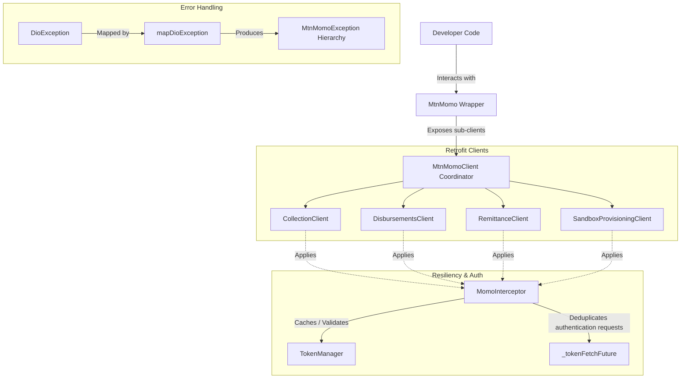

# MTN Mobile Money Collections & Disbursements SDK (Dart/Flutter)

## Architectural Design Reference

This document provides a highly technical, deep-dive reference of the internals of the `mtn_momo_sdk` package, outlining how components integrate, code-generation rules, custom class patterns, and testing conventions.

---

## 🏗 High-Level Architecture

The codebase is split into three main logical layers:
1. **Raw API Layer (Generated)**: Type-safe REST clients generated using `retrofit` and serialized via `dart_mappable`.
2. **Plumbing & Resiliency Layer (Manual)**: Custom Interceptors (`MomoInterceptor`), Token Management (`TokenManager`), and Request Deduplication.
3. **High-Level Coordinator & Wrapper Layer (Manual)**: Standard `MtnMomoClient` coordinator and unified wrapper `MtnMomo`.



---

## 🛠 Code Generation Architecture

The project relies on [swagger_parser](https://pub.dev/packages/swagger_parser) to generate clean Retrofit clients and models from raw JSON specifications located inside `./schemes/`.

### Configuration Details (`swagger_parser.yaml`)
* **Output Path**: Generated files reside inside `lib/src/generated/` to isolate them from manual SDK enhancements.
* **JSON Serializer**: `dart_mappable` is used exclusively. Avoid using standard `json_serializable` as `dart_ mappable` provides superior polymorphism support, type safety, and clean builder methods.
* **Root Client**: Set to `false` (we compose our own unified `MtnMomoClient` manually in `lib/src/generated/mtn_momo_client.dart`).
* **Skipped Headers**: To enable a clean, developer-shielded experience when utilizing `MtnMomo` (where the interceptor injects dynamic auth and environment headers automatically), the `skipped_parameters` array is configured in `swagger_parser.yaml` to omit `Authorization` and `X-Target-Environment` from client method signatures. This leaves `X-Reference-Id` as a standard parameter so developers can provide custom transaction-tracking UUIDs.

### Code Generation Pipeline
To compile changes to schemas, run the following pipeline:
```bash
dart run swagger_parser
dart run build_runner build --delete-conflicting-outputs
```

---

## 🛡 Network Resiliency & Token Lifecycle

A key engineering requirement of this SDK is shielding the developer from handling OAuth2 token validation, caching, and refresh logic.

### 1. Interceptor-Based Injection (`MomoInterceptor`)
The `MomoInterceptor` (located in `lib/src/interceptors/momo_interceptor.dart`) listens to outbound network requests for Collections and Disbursements APIs and:
* Automatically appends the `Ocp-Apim-Subscription-Key`.
* Automatically appends the `X-Target-Environment` (defaults to `sandbox`).
* Inspects if the target endpoint requires OAuth2 protection. If it does, it checks the local cache in `TokenManager`. If the token is expired or absent, it triggers the registered token fetch callback.

### 2. Thread-Safe Token Fetch Deduplication
To prevent simultaneous parallel API calls from initiating multiple concurrent authentication requests, the high-level client implements token fetch deduplication:
```dart
Future<String?>? _tokenFetchFuture;

Future<String?> _fetchToken() async {
  if (_tokenFetchFuture != null) {
    return _tokenFetchFuture; // Wait on the active request
  }

  _tokenFetchFuture = () async {
    try {
      final response = await _collectionClient.createAccessToken();
      _tokenManager.setToken(response);
      return response.accessToken;
    } catch (e) {
      _logger.e('Error fetching token', error: e);
      return null;
    } finally {
      _tokenFetchFuture = null; // Clean up future reference
    }
  }();

  return _tokenFetchFuture;
}
```

### 3. Product Token Isolation (Avoiding Cache Collisions)
> [!WARNING]
> Because `MtnMomo` utilizes a single shared `TokenManager` cache inside its interceptor, sharing a single `MtnMomo` instance to invoke Collections, Disbursements, and Remittances concurrently is strongly discouraged.
> Since each product has distinct credentials (subscription keys, user IDs, and API keys) and requires distinct OAuth2 tokens, sharing a client instance will cause access token cache collisions, resulting in HTTP 401 Unauthorized errors on subsequent requests.
>
> **Best Practice Recommendation**: Developers must always instantiate separate, dedicated instances of `MtnMomo` for Collections, Disbursements, and Remittances to isolate their token cache lifecycles.

---

## 🔒 Custom SDK Exception Hierarchy

MTN Mobile Money API errors range from standard network issues to highly structured transaction-level business failures. Rather than leaving developers to inspect raw status codes or map response fields manually, the SDK sifts all outbound `DioException` states through `mapDioException()` inside `lib/src/exceptions.dart`.

### Custom Exception Map

```
DioException
 └── MtnMomoException (Base class)
      ├── MtnMomoNetworkException       (Handshake timeouts, DNS failures)
      ├── MtnMomoAuthException          (HTTP 401: Invalid subscription key / API User / API Key)
      ├── MtnMomoForbiddenException     (HTTP 403: Originating IP is not whitelisted)
      ├── MtnMomoNotFoundException      (HTTP 404: Transaction/Pre-Approval ID not found)
      ├── MtnMomoConflictException      (HTTP 409: Reference UUID already utilized)
      ├── MtnMomoServerException        (HTTP 500/503: MoMo platform infrastructure failures)
      └── MtnMomoTransactionException   (HTTP 400/500 with native business logic failure codes)
```

### Business Logic Error Verification (`MtnMomoErrorCode`)
`MtnMomoTransactionException` wraps a parsed `MtnMomoErrorCode` enum. This represents standard error codes documented on the official portal, such as:
* `PAYER_LIMIT_REACHED`: Payer wallet exceeds maximum limits.
* `NOT_ENOUGH_FUNDS`: Insufficient customer funds to cover transaction.
* `APPROVAL_REJECTED`: Customer rejected the USSD PIN request.
* `PAYER_NOT_FOUND`: Target MSISDN is invalid or unregistered.

---

## 🧪 Testing Guidelines

Testing is treated as a P0 requirement for ensuring zero regression in API schemas and exceptional client instantiation stability.

### Test Directory Layout
* `test/exceptions_test.dart`: Validates full coverage of raw Dio JSON responses mapped into correct sub-classes of `MtnMomoException` and verifies error code parsing accuracy.
* `test/mtn_momo_sdk_test.dart`: Validates coordinator construction, sub-client provisioning, and barrel file export integrity.
* `test/sandbox_usecases_test.dart`: Validates sandbox use cases for Collections, Disbursements, and Remittances against live/mocked environments.
* `test/manual_sandbox_test.dart`: An execution script allowing automated validation against a live sandboxed endpoint (validates programmatic user creation, API key retrieval, and balance check).
* `test/disbursements_test.dart`: Dedicated unit/integration tests for disbursements workflows.
* `test/token_manager_test.dart`: Tests token caching, expiration detection, and thread-safe fetching.
* `test/momo_interceptor_test.dart`: Verifies header injection, authorization flow, and environmental routing.

### Execution Commands
* **Run entire unit suite**:
  ```bash
  dart test
  ```
* **Run manual sandbox validation**:
  Ensure a valid `subscriptionKey` is defined in `test/manual_sandbox_test.dart`, then execute:
  ```bash
  dart test/manual_sandbox_test.dart
  ```
