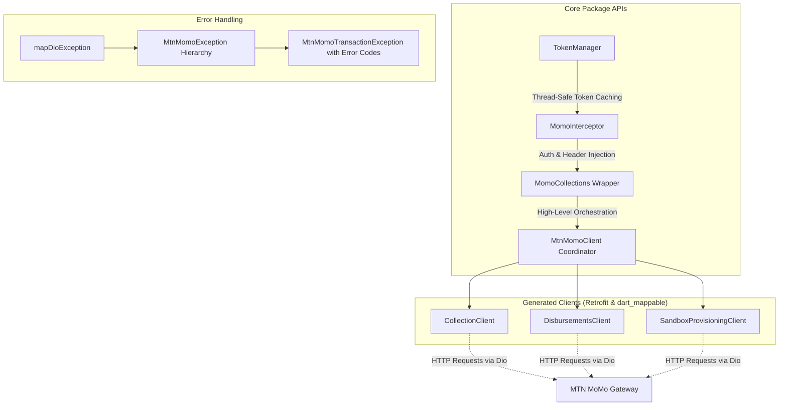

# MTN Mobile Money (MoMo) SDK for Dart & Flutter

[](https://pub.dev)
[](https://dart.dev)
[](https://flutter.dev)
[](LICENSE)

An elegant, type-safe, and robust Dart & Flutter SDK for integrating with the **MTN Mobile Money (MoMo) API**. This package supports sandboxed and production environments across all active African markets (e.g., Uganda, Ghana, Cameroon, Côte d'Ivoire, Zambia).

> [!WARNING]
> This is an unofficial community package. It is not affiliated with, endorsed by, or officially connected to MTN Group or any of its subsidiaries.

---

## Architecture Overview

This SDK is engineered with a layered, modular architecture. Rather than writing fragile manual HTTP wrappers, the entire API layer is generated from MTN's OpenAPI specifications, ensuring full coverage, strict compliance, and future-proof extensibility.



### Highlights
* **Unified Client Coordinator (`MtnMomoClient`)**: A single entry point providing access to generated clients: `CollectionClient`, `DisbursementsClient`, and `SandboxProvisioningClient`.
* **Advanced High-Level Wrapper (`MomoCollections`)**: Handles tedious authentication plumbing automatically.
* **Automated OAuth2 Token Lifecycle**: Built-in token caching, lifecycle validation, and lazy auto-refresh.
* **Concurrent Token Deduplication**: Concurrent API requests seamlessly await a single ongoing token generation process, preventing race conditions or redundant token creation hits.
* **Rich Native Exception Hierarchy**: Maps complex raw HTTP & MTN errors into distinct Dart Exceptions (`MtnMomoNetworkException`, `MtnMomoAuthException`, `MtnMomoTransactionException`, etc.).

---

## Getting Started

### Installation

Add the package to your `pubspec.yaml`:

```yaml
dependencies:
  mtn_momo_collections: ^0.0.1
  dio: ^5.9.0
```

Run pub get:
```bash
dart pub get
```

### Best Practice: Product Token Isolation

> [!IMPORTANT]
> **Collections** and **Disbursements** are configured as different products on the MTN MoMo Developer Portal and use separate subscriptions, User IDs, API Keys, and target environment scopes.
>
> Under the hood, `MomoCollections` utilizes a local `TokenManager` cache. If you attempt to share a single `MomoCollections` instance for both Collections and Disbursements, their access tokens will collide and overwrite each other in the shared cache, resulting in **`401 Unauthorized`** or **`403 Forbidden`** errors.
>
> **Recommendation**: Always instantiate **separate, dedicated instances** of `MomoCollections` for Collections and Disbursements:
>
> ```dart
> // Dedicated Collections Instance
> final collectionsMomo = MomoCollections(
>   baseUrl: 'https://sandbox.momodeveloper.mtn.com',
>   subscriptionKey: collectionsSubKey,
>   userId: collectionsUserId,
>   apiKey: collectionsApiKey,
> );
>
> // Dedicated Disbursements Instance
> final disbursementsMomo = MomoCollections(
>   baseUrl: 'https://sandbox.momodeveloper.mtn.com',
>   subscriptionKey: disbursementsSubKey,
>   userId: disbursementsUserId,
>   apiKey: disbursementsApiKey,
> );
> ```

---

## 🛠 Complete Sandbox Walkthrough

Integrating with MTN MoMo Sandbox requires provisioning a dynamic API User and requesting an API Key before initializing transaction calls. Here is the full programmatic walkthrough:

```dart
import 'package:dio/dio.dart';
import 'package:logger/logger.dart';
import 'package:uuid/uuid.dart';
import 'package:mtn_momo_collections/mtn_momo_collections.dart';

final logger = Logger();

void main() async {
  const baseUrl = 'https://sandbox.momodeveloper.mtn.com';
  // Retrieve subscription key from momodeveloper.mtn.com
  const subscriptionKey = 'YOUR_OCP_APIM_SUBSCRIPTION_KEY'; 

  // Initialize the baseline Dio client
  final dio = Dio(
    BaseOptions(
      baseUrl: baseUrl,
      headers: {
        'Ocp-Apim-Subscription-Key': subscriptionKey,
        'Content-Type': 'application/json',
      },
    ),
  );

  // 1. Instantiate the Sandbox User Provisioning API Client
  final sandboxProvisioner = SandboxProvisioningClient(dio);
  final userUuid = const Uuid().v4();

  logger.i('Creating Sandboxed API User: $userUuid');
  try {
    await sandboxProvisioner.postV10Apiuser(
      xReferenceId: userUuid,
      apiUser: ApiUser(providerCallbackHost: 'your-callback-domain.com'),
    );
    logger.i('API User created successfully.');
  } catch (e) {
    logger.e('Failed to create API User', error: e);
    return;
  }

  // Allow the sandbox database to propagate the newly created user
  await Future.delayed(const Duration(seconds: 2));

  // 2. Request an API Key associated with the newly created API User
  logger.i('Requesting Sandbox API Key...');
  String? apiKey;
  try {
    final result = await sandboxProvisioner.postV10ApiuserApikey(
      xReferenceId: userUuid,
    );
    apiKey = result.apiKey;
    logger.i('Sandbox API Key acquired: $apiKey');
  } catch (e) {
    logger.e('Failed to acquire API Key', error: e);
    return;
  }

  if (apiKey == null) return;

  // 3. Initialize the production-ready MomoCollections client
  final momo = MomoCollections(
    baseUrl: baseUrl,
    subscriptionKey: subscriptionKey,
    userId: userUuid,
    apiKey: apiKey,
    targetEnvironment: 'sandbox',
  );

  // 4. Perform transaction operations (the Token is automatically fetched on the fly!)
  logger.i('Fetching Account Balance...');
  try {
    final balance = await momo.collection.getAccountBalance();
    logger.i('Current Balance: ${balance.availableBalance} ${balance.currency}');
  } catch (e) {
    logger.e('Operation failed', error: e);
  }
}
```

---

## ⚡ Core Integration Scenarios

### Collections API

Initiate collections payments from customer wallets to your merchant account.

```dart
// Initialize the client
final momo = MomoCollections(
  baseUrl: 'https://sandbox.momodeveloper.mtn.com',
  subscriptionKey: 'YOUR_SUBSCRIPTION_KEY',
  userId: 'YOUR_PROVISIONED_USER_ID',
  apiKey: 'YOUR_PROVISIONED_API_KEY',
);

// 1. Validate customer account holder status
try {
  await momo.collection.validateAccountHolderStatus(
    accountHolderId: '256772123456',
    accountHolderIdType: 'msisdn',
  );
  print('Account holder is active and verified.');
} on MtnMomoTransactionException catch (e) {
  print('Account holder validation failed: ${e.errorCode.description}');
}

// 2. Request customer payment (Push USSD)
final referenceUuid = 'a9b8c7d6-e5f4-3a2b-1c0d-9e8f7a6b5c4d'; // Unique UUID v4
final requestToPayBody = RequestToPay(
  amount: '5000',
  currency: 'EUR',
  externalId: 'PAY_INV_88764',
  payer: const Party(
    partyIdType: PartyPartyIdType.msisdn,
    partyId: '256772123456',
  ),
  payerMessage: 'Premium Subscription Renewal',
  payeeNote: 'Thank you for choosing Antigravity Solutions',
);

try {
  await momo.collection.requesttoPay(
    xReferenceId: referenceUuid,
    body: requestToPayBody,
  );
  print('Payment request dispatched to customer handset.');
} catch (e) {
  print('Payment initialization error: $e');
}

// 3. Poll transaction status
try {
  final status = await momo.collection.requesttoPayTransactionStatus(
    referenceId: referenceUuid,
  );
  print('Transaction Status: ${status.status}');
  print('Reason Code: ${status.reason?.code}');
} catch (e) {
  print('Status check failed: $e');
}
```

### Disbursements API

Safely pay out money from your merchant account directly into a recipient's mobile wallet.

```dart
// 1. Initialize Transfer
final transferUuid = 'f8e7d6c5-b4a3-2b1a-0f9e-8d7c6b5a4f3e'; // Unique UUID v4
final transferBody = Transfer(
  amount: '12000',
  currency: 'EUR',
  externalId: 'DISB_SAL_4431',
  payee: const Party(
    partyIdType: PartyPartyIdType.msisdn,
    partyId: '256772987654',
  ),
  payerMessage: 'Monthly Salary Disbursement',
  payeeNote: 'Salary processed successfully',
);

try {
  await momo.disbursements.transfer(
    xReferenceId: transferUuid,
    body: transferBody,
  );
  print('Disbursement transfer initialized.');
} catch (e) {
  print('Disbursement initialization failed: $e');
}

// 2. Fetch disbursement transfer status
try {
  final status = await momo.disbursements.getTransferStatus(
    referenceId: transferUuid,
  );
  print('Disbursement Status: ${status.status}');
} catch (e) {
  print('Disbursement check failed: $e');
}
```

---

## 📂 Standalone Modular Examples Suite

We have created individual standalone example files for each core integration scenario in the [example/](example/) directory. You can run them directly from the CLI to quickly test your integration:

*   [sandbox_provisioning_example.dart](example/lib/sandbox_provisioning_example.dart) — Provision Sandbox API User and generate API key.
*   [collections_example.dart](example/lib/collections_example.dart) — Initiate payment, poll transaction status, check collections balance.
*   [disbursements_example.dart](example/lib/disbursements_example.dart) — Check recipient status, trigger transfer, check disbursements balance.
*   [resilient_error_handling_example.dart](example/lib/resilient_error_handling_example.dart) — Handle specific exceptions and map transaction failure error codes.
*   [thread_safety_deduplication_example.dart](example/lib/thread_safety_deduplication_example.dart) — Parallel asynchronous request safety and token deduplication.

See the [example/README.md](example/README.md) for detailed configuration and execution commands.


---

## 🔒 Advanced Resilient Exception Handling

Dio errors are often flat, structured strings. The SDK intercepts errors and wraps them into distinct custom `MtnMomoException` types to allow clean, idiomatic catch flows:

```dart
try {
  final balance = await momo.collection.getAccountBalance();
} on MtnMomoNetworkException {
  print('Unable to reach the server. Please verify your connection.');
} on MtnMomoAuthException catch (e) {
  print('Authentication Error (HTTP 401): ${e.message} - ${e.details}');
} on MtnMomoForbiddenException {
  print('Forbidden (HTTP 403): Ensure your server IP is whitelisted on the portal.');
} on MtnMomoNotFoundException {
  print('Resource not found (HTTP 404).');
} on MtnMomoConflictException {
  print('Conflict (HTTP 409): This reference UUID has already been utilized.');
} on MtnMomoTransactionException catch (e) {
  // Access rich mapped enum values from official MTN documentation
  print('Transaction Business Logic Error Code: ${e.errorCode.code}');
  print('Error Description: ${e.errorCode.description}');
  
  switch(e.errorCode) {
    case MtnMomoErrorCode.payerLimitReached:
      print('The customer has reached their daily wallet limits.');
      break;
    case MtnMomoErrorCode.notEnoughFunds:
      print('The customer\'s account has insufficient funds.');
      break;
    case MtnMomoErrorCode.approvalRejected:
      print('The customer rejected the payment prompt.');
      break;
    default:
      print('Unhandled transaction failure.');
  }
} on MtnMomoServerException {
  print('MTN Server is experiencing technical difficulties.');
} catch (e) {
  print('Unexpected non-SDK error: $e');
}
```

### Supported Transaction Error Enums (`MtnMomoErrorCode`)

| Error Code Enum | Raw API Value | Official Description |
| :--- | :--- | :--- |
| `payeeNotFound` | `PAYEE_NOT_FOUND` | Recipient MSISDN is invalid or unregistered. |
| `payerNotFound` | `PAYER_NOT_FOUND` | Sender MSISDN does not exist or is invalid. |
| `invalidCallbackUrlHost` | `INVALID_CALLBACK_URL_HOST` | Callback URL host must be a domain name, not an IP. |
| `invalidReferenceId` | `INVALID_REFERENCE_ID` | Reference ID (UUID v4) is invalid or malformed. |
| `resourceNotFound` | `RESOURCE_NOT_FOUND` | The specified transaction or reference cannot be located. |
| `resourceAlreadyExist` | `RESOURCE_ALREADY_EXIST` | Duplicate reference ID supplied. |
| `payerLimitReached` | `PAYER_LIMIT_REACHED` | Daily/Monthly wallet limits hit by customer. |
| `approvalRejected` | `APPROVAL_REJECTED` | User manually cancelled prompt or timed out. |
| `notEnoughFunds` | `NOT_ENOUGH_FUNDS` | Wallet has insufficient balance. |
| `senderAccountNotActive` | `SENDER_ACCOUNT_NOT_ACTIVE` | Payer's wallet is frozen or inactive. |
| `internalProcessingError` | `INTERNAL_PROCESSING_ERROR` | Core processing engine error. |
| `couldNotPerformTransaction`| `COULD_NOT_PERFORM_TRANSACTION` | System failure to complete transaction. |
| `forbiddenIp` | `FORBIDDEN_IP` | Source server IP is blocked. |
| `accessDenied` | `ACCESS_DENIED` | Invalid subscription key or products. |

---

## 🛠 Development & Code Generation

If you modify the Swagger specifications under the `schemes/` directory, you must run code generation:

1. **Model Parsing**:
   Modify models or schemas in `schemes/` (e.g. `collection.json`, `disbursement.json`, `sandbox-provisioning-api.json`).
   
2. **Build Generated Files**:
   Execute the Dart compiler code generator:
   ```bash
   dart pub get
   dart run build_runner build --delete-conflicting-outputs
   ```

3. **Running SDK Tests**:
   Run the regression test suite:
   ```bash
   dart test
   ```

---

## 📜 License

Distributed under the MIT License. See [LICENSE](LICENSE) for more details.